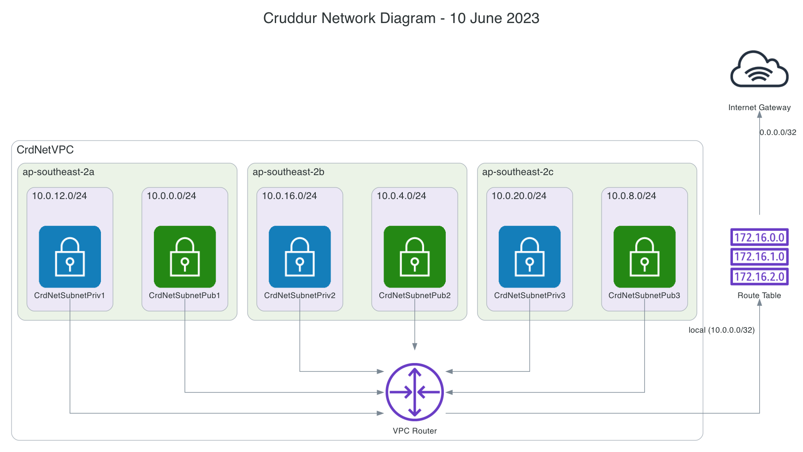

# can-haz-diagrams - Programmatically diagramming the Cruddur Stack

### Diagramming the network layer

A diagram created using the Python library [Diagrams](https://diagrams.mingrammer.com/) attemping to capture the spirit of the lucid chart diagram [created here](https://www.youtube.com/watch?v=lb3aKVVMn7U)

