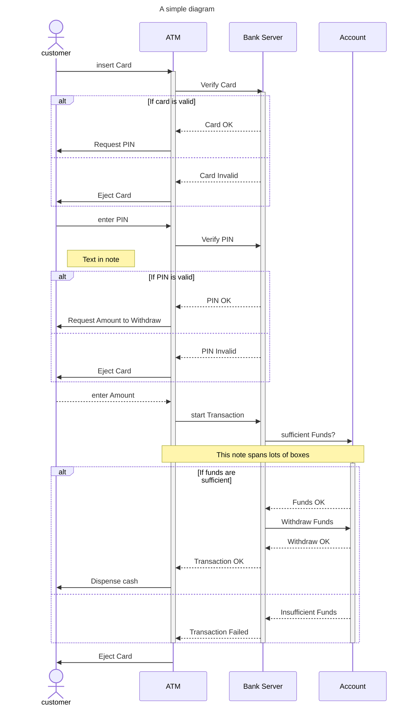

Mermaid JS experimentation with the chart described https://www.youtube.com/watch?v=pCK6prSq8aw&t=31s

try these extensions
https://github.com/bpruitt-goddard/vscode-mermaid-syntax-highlight

look at this formatting post
https://notepad.onghu.com/2024/making-mermaid-sequence-diagrams-prettier-part1/

docs https://mermaid.js.org/syntax/sequenceDiagram.html

cheat sheet https://jojozhuang.github.io/tutorial/mermaid-cheat-sheet/

