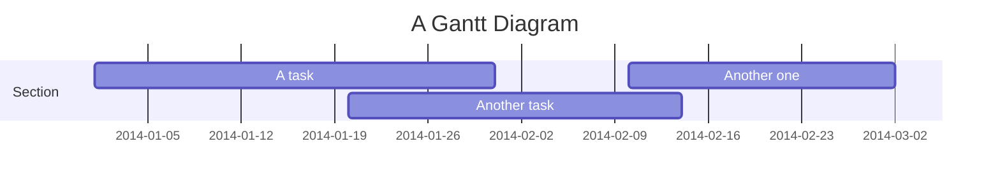
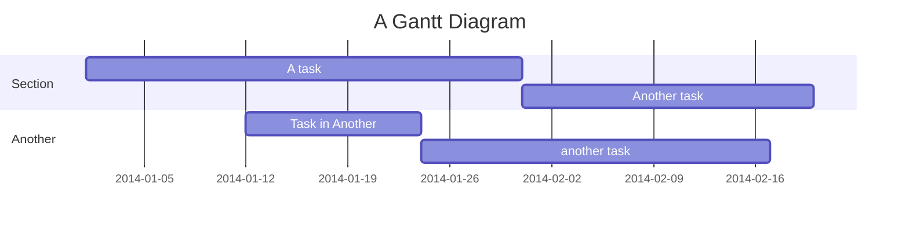
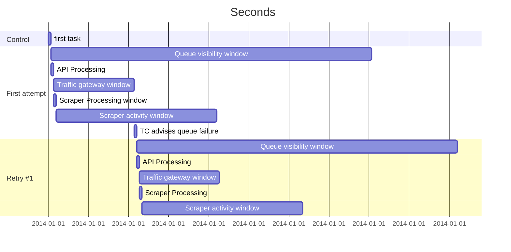

```mermaid
---
displayMode: compact
---

gantt
title A Gantt Diagram
dateFormat YYYY-MM-DD

    section Section
    A task           :a1, 2014-01-01, 30d
    Another task     :a2, 2014-01-20, 25d
    Another one      :a3, 2014-02-10, 20d
```

```mermaid
gantt
    title A Gantt Diagram
    dateFormat YYYY-MM-DD
    section Section
        A task          :a1, 2014-01-01, 30d
        Another task    :after a1, 20d
    section Another
        Task in Another :2014-01-12, 12d
        another task    :24d
```

tell me about using other timespans like seconds

```mermaid
gantt
    dateFormat HH:mm
    axisFormat %H:%M
    Initial milestone : milestone, m1, 17:49, 2m
    Task A : 10m
    Task B : 5m
    Final milestone : milestone, m2, 18:08, 4m

```

```mermaid
gantt
    title Seconds
    dateFormat s ss
    section Control
    first task  :a1, 2014-01-01, 1s

    section First attempt
        Queue visibility window          :m1, after a1, 120s
        API Processing          :p1, after a1, 1s
          Traffic gateway window          :tc1, after p1, 30s
        Scraper Processing window          :r1, after p1, 1s
          Scraper activity window          :c1, after r1, 60s
          TC advises queue failure         :tc1b, after tc1, 1s


    section Retry #1
        Queue visibility window          :m2, after tc1b, 120s
        API Processing          :p2, after tc1b, 1s
          Traffic gateway window           :tc2, after p2, 30s
        Scraper Processing          :r2, after p2, 1s
          Scraper activity window          :c2, after r2, 60s


```
